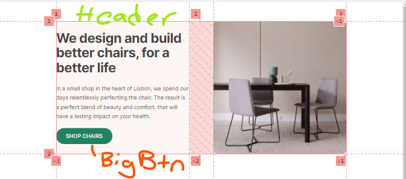
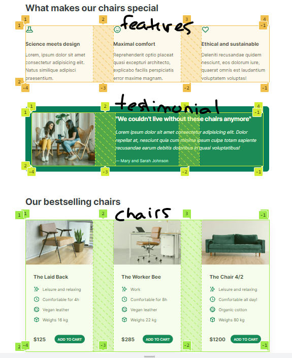
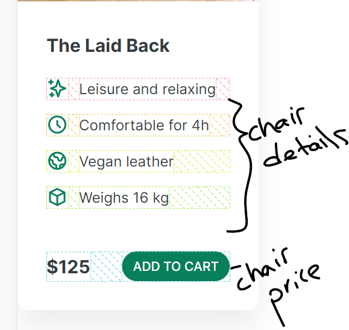

# Open README.md in VS Code by right-clicking and selecting "Open Preview"

# Instructions

The Goal Website is provided as a PDF.

Change only the style.css sheet.

Use your INSPECT tool in the browser to observe the layout changes as you make them.

### Submit in Github when complete.

## Pictures for closer inspection

## Style Notes

- Container has width of 960px and is centered.
- Use the same three column layout for Features, testimonials and chair cards. Column gap is 80px.
- Both buttons have linked/visited style that is the same.
- Both buttons have hover/active style that is the same background color of #099268.
- Big Button has large font and padding.
- Small button has small font and padding.
- Header has a layout. It has a column gap of 80px.
- Testimonial Section has colors and padding and round-borders.
- Tesimonial Box has grid layout.
- Testimonial Text has font styling and color #e6fcf5.
- Testimonial Author has color #c3fae80
- Chair Details has list style changed.
- Chair Details List Items have a layout and a gap of 12px.
- Chair Price has a layout.
